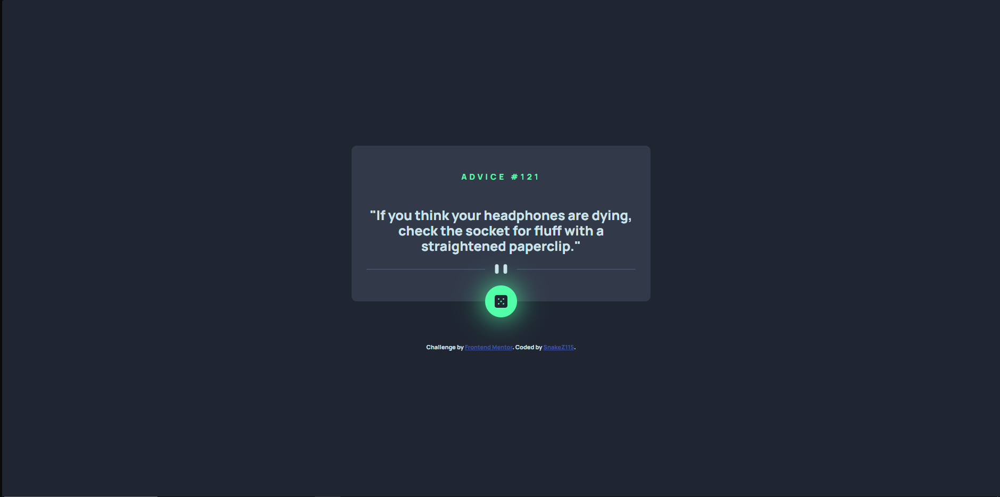

# Frontend Mentor - Advice generator app solution

This is a solution to the [Advice generator app challenge on Frontend Mentor](https://www.frontendmentor.io/challenges/advice-generator-app-QdUG-13db). Frontend Mentor challenges help you improve your coding skills by building realistic projects.

## Table of contents

- [Overview](#overview)
  - [The challenge](#the-challenge)
  - [Screenshot](#screenshot)
  - [Links](#links)
- [My process](#my-process)
  - [Built with](#built-with)
  - [What I learned](#what-i-learned)
  - [Continued development](#continued-development)
  - [Useful resources](#useful-resources)
- [Author](#author)

## Overview

### The challenge

Users should be able to:

- View the optimal layout for the app depending on their device's screen size
- See hover states for all interactive elements on the page
- Generate a new piece of advice by clicking the dice icon

### Screenshot

### Links

- Solution URL: [FrontEnd Mentor](https://www.frontendmentor.io/solutions/advice-generator-with-html-css-and-js--0ctkhdk7a)
- Live Site URL: [Netlify](https://tubular-sunburst-7d3663.netlify.app)

## My process

### Built with

- Semantic HTML5 markup
- CSS custom properties
- Flexbox
- CSS Grid
- Mobile-first workflow
- Vanilla JavaScript

### What I learned

At the time, I started taking a JS course so, with this project, I put in practice all I am learing right now about JavaScript. 
For this project I only use fetch to call the Advice API.
Any feedback is really welcomed :D

### Continued development

I wanna keep practicing because I liked to add some interactivity to the website.

### Useful resources

- [Box-Shadow CSS](https://developer.mozilla.org/es/docs/Web/CSS/box-shadow) - This helped me to make the box shadow effect.
- [Media Queries Breakpoints](https://dev.to/gerryleonugroho/responsive-design-breakpoints-2025-playbook-53ih) - This is an amazing website that talks about some breakpoints for media queries.
- [Advice API](https://api.adviceslip.com) - This is the Advice API. There is some information about how to use it.

## Author

- Frontend Mentor - [@SnakeZ115](https://www.frontendmentor.io/profile/SnakeZ115)

